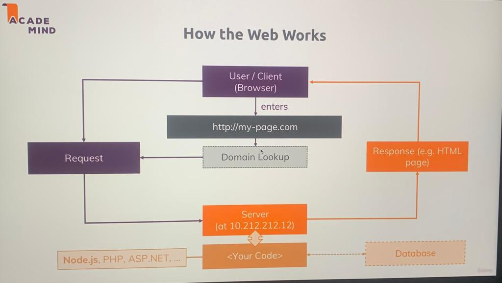

# 24 : Module Introduction

# what all we will be learning in this module 

1. How does the web works (refresher) ?
2. creating a Node js server.
3. Using node core modules.
4. working with request and responses (Basic).
5. Asynchronous code and the Event loop.

---
# 25 : How the web works ?
this below is the image from the course itself.


### what are the HTTP and HTTPS protocols

1. hyper text transfer protocol ==> it is understood by the browser and is the set of rules that construct the way a request must be made.
2. hyper text transfer protocol secure ==> it is same as the HTTP but with Data encryption (during data transmission)

---

# 26 : Creating a node server

1. created a nodejs server at first-nodejs-server folder
2. below , these are the core nodejs modules

   http ----> is used to launch a server and send requests.

   https ---> is used to launch a ssl encrypted server

   fs ------> is used to access the file system of the machine on which the server is running

   path ----> is used to set paths of files and many other things like images and icons.

   os ------> is used to have access to the operating system of the machine on which the server is up and running

3. 
```js
// require is a special reserved keyword in js which is used to access modules which are made for js applications

const http = require('http') // this will seatch for a module named http
const http = require('./http') // (absolute path) this will seatch for a https.js file in the same directory locally
const http = require('/http') // (relative path) this will seatch for a https.js file in the same directory locally
// three of the above examples auto complete the .js extension by there own 

```
4.  here below is the code which is so basic : 
```js
const http = require('http') 

// we stored the server into the server variable which is returned by the createServer method on the http module

const server = http.createServer((req,res)=>{
    console.log(req)
})

// this below line means the server will listen at the (localhost:3000) whenever a new request is gemerated on the port 3000.
server.listen(3000)
```

---

# 27 : the node lifecycle and the eventloop

node js program life cycle is as given below
1. we run the server using the " node app.js " command then
2. node starts the script which we have written in our app.js then
3. code get's parsed , variables and functions are registered by node then
4. with the help of event loop our program runs untill it has eventlistners registered

we have a brief example of lifecycle of nodejs on the below link to gfg
https://www.geeksforgeeks.org/nodejs-program-lifecycle/

Lifecycle of Node.js program: In order to understand its lifecycle you must be familiar with the event loop. Event loops are something that makes your task very fast and also it perform multitasking. It allows Node.js to perform non-blocking I/O operations. You can learn more about event loop here. When you run your node file using node app.js then the script starts executing. It will be parsed by the parser into machine language that simply means all the functions and variables get registered in a memory location. After parsing the code our program reaches the point where it will not exit and will run an infinite no. of times which is possible all because of the event loop. Once the event loop has started executing and it will run as long as event listeners are registered.

Example: You have the database and you have to access data from the database or you want to insert something into a database that simply requires some calling of the functions so when you call them it will take some amount of time (maybe nanoseconds or microseconds but it will take some time) so it is not possible for every request that we can wait for that particular time and then we move on to next request so that is where event loop comes into the picture. Your database part will be run in the background and the event loop will be running continuously so that it can handle the need for another request as well. This will be done on a single thread in node.js. You can also come out of the loop explicitly by using process.exit().

```diff
- note
+ nodejs is able to work and keep our server up and running due to the eventloop 
+ eventloop is the one and only thing which is responsible to keep our server running and also doing multitasking.
+ this is the line which registered an event listener into the eventloop and 
+ will keep that event listner of request in the eventloop untill we dont say it to 
+ remove it , and thats why it is able to keep the server running with looping the same line of code of listening.
        const server = http.createServer((req,res)=>{
            console.log(req)
        })

        ```
+ here if we use the process.exit() , what it does is that it hard exitted the eventloop which we typically do not do to our server as we want our server to be running .
```
5. code for app.js
```js
const http = require('http') 

// we stored the server into the server variable which is returned by the createServer method on the http module

const server = http.createServer((req,res)=>{
    console.log(req)
    //  here if we use the process.exit() , what it does is that it hard exitted the eventloop which we typically do not do to our server as we want our server to be running .
    // process.exit()
})

// this below line means the server will listen at the (localhost:3000) whenever a new request is gemerated on the port 3000.
server.listen(3000)
```

---

# 28 : Controlling the Node.js Process
 
Want to quit your running Node.js server?

You can always do that by pressing CTRL + C in the terminal/ command prompt window where you started your server (i.e. where you ran node app.js).

---

# 29 : understanding requests 

after running the below code we got the below result :
code :
```js
const server = http.createServer((req,res)=>{
    console.log("request.url -->  "+req.url )
    console.log("request.method -->  "+req.method )
    console.log(req.headers)
    //  here if we use the process.exit() , what it does is that it hard exitted the eventloop which we typically do not do to our server as we want our server to be running .
    process.exit()
})
```

and the result we got after running the " node app.js " command is as below:

```shell
request.url -->  /sss
request.method -->  GET
{
  host: 'localhost:8080',
  connection: 'keep-alive',
  'cache-control': 'max-age=0',
  'sec-ch-ua': '"Not_A Brand";v="99", "Google Chrome";v="109", "Chromium";v="109"',
  'sec-ch-ua-mobile': '?0',
  'sec-ch-ua-platform': '"macOS"',
  'upgrade-insecure-requests': '1',
  'user-agent': 'Mozilla/5.0 (Macintosh; Intel Mac OS X 10_15_7) AppleWebKit/537.36 (KHTML, like Gecko) Chrome/109.0.0.0 Safari/537.36',
  accept: 'text/html,application/xhtml+xml,application/xml;q=0.9,image/avif,image/webp,image/apng,*/*;q=0.8,application/signed-exchange;v=b3;q=0.9',
  'sec-fetch-site': 'none',
  'sec-fetch-mode': 'navigate',
  'sec-fetch-user': '?1',
  'sec-fetch-dest': 'document',
  'accept-encoding': 'gzip, deflate, br',
  'accept-language': 'en-US,en;q=0.9',
  cookie: 'adb=0; ufi=1; _gcl_au=1.1.71061844.1676256894; _ga=GA1.1.1650143955.1676256899; _gid=GA1.1.708053828.1676256899; inactivityTimer=1'
}
```

---

# 30 : Sending responses 

code :
```js
const http = require('http') 

// we stored the server into the server variable which is returned by the createServer method on the http module

const server = http.createServer((req,res)=>{
    console.log("request.url -->  "+req.url )
    console.log("request.method -->  "+req.method )
    console.log(req.headers)
    //  here if we use the process.exit() , what it does is that it hard exitted the eventloop which we typically do not do to our server as we want our server to be running .
    // this setHeader sets the type of response we will be giving back in reponse
    res.setHeader('Content-Type','text/html');
    // this res.write() method is used to write the response line by line
    res.write('<html>')
    res.write('<head><title>My first Page</title></head>')
    res.write('<body><h1>Hey !! welcome to nodejs</h1></body>')
    res.write('</html>')
    // once we used the res.end method we now cant use the res.write method or else it will throw unwanted errors.
    res.end()
    // process.exit()
})

// this below line means the server will listen at the (localhost:3000) whenever a new request is gemerated on the port 3000.
server.listen(8080)
```
---
# 31 : Request & Response Headers
On both requests and responses, Http headers are added to transport metadata from A to B.

The following article provides a great overview of available headers and their role: https://developer.mozilla.org/en-US/docs/Web/HTTP/Headers

Whilst this article is a great resource, especially to dive deeper, please don't learn this list by heart though! You'll encounter many of these headers throughout the course and I'll explain them when we need them.

---

# 32 : Routing requests 

we used simple if statement and  a return statement to route our requests which is  a cruicial task while developing a server cause by routing we can return different res on different urls.

code : 
```js
const server = http.createServer((req,res)=>{
 const url = req.url
 if(url === '/'){
    res.write('<html>')
    res.write('<head><title>Enter Message</title></head>')
    // the action attr will submit this form and will push the url to domain/message and the method attr will specify the request method as post and the name attr in input is very special as it will append the input value in request.message which we can use to process some further operations.
    res.write('<body><form action="/message" method="POST" ><input name="message" type="text"></input><button>Send</button></form></body>')
    res.write('</html>')
   // we must return here the res.end() as we dont want to continue any further in this function or else it will also continue to run rest of the func.
   return res.end()
 }
    //  here if we use the process.exit() , what it does is that it hard exitted the eventloop which we typically do not do to our server as we want our server to be running .
    // this setHeader sets the type of response we will be giving back in reponse
    res.setHeader('Content-Type','text/html');
    // this res.write() method is used to write the response line by line
    res.write('<html>')
    res.write('<head><title>My first Page</title></head>')
    res.write('<body><h1>Hey !! welcome to nodejs</h1></body>')
    res.write('</html>')
    // once we used the res.end method we now cant use the res.write method or else it will throw unwanted errors.
    res.end()
    // process.exit()
})
```

---

# 33 : Redirecting requests

in this video we learnt about , how to redirect the user to a url using the setHeader function of response obj . and also found the way to write a file into the file system using the filesystem utility lib "fs" the code for the same is given below.

```js
 if(url === '/message' && method === 'POST'){
   // using the writeFileSync method to create a new file into the system.
   fs.writeFileSync('message.txt','DUMMY');
   // here using the 302 status code which stands for redirection 
   res.statusCode = 302;
   // here setting the headers location to be home page 
   res.setHeader('Location','/')
   // never forget to return the res.end().
   return res.end();
 }
 ```
 ---

 # 34 : Parsing Request Bodies

 code .
 ```js
  if(url === '/message' && method === 'POST'){
   const body =[];
// this below on data function in called by nodejs when ever it has some thing in the requests data stream and calls this function for each individual chunk of the whole data.
   req.on('data', (chunk)=>{
     console.log(chunk);
     body.push(chunk);
   })
   // this on end is called when each chunk got processed and at the end it writes to the file.
   req.on('end',()=>{
      const parsedBody = Buffer.concat(body).toString();
      const message = parsedBody.split('=')[1];
      fs.writeFileSync('message.txt',message);
   })
   // using the writeFileSync method to create a new file into the system.
   // fs.writeFileSync('message.txt','DUMMY');
   // here using the 302 status code which stands for redirection 
   res.statusCode = 302;
   // here setting the headers location to be home page 
   res.setHeader('Location','/')
   // never forget to return the res.end().
   return res.end();
 }
 ```

---
# 35: Understanding Event Driven Execution.

1. Node js works asyncronously to handle multiple requests at the same time
2. for this what it does is that it registers an event into its events registory and contineus to execute the next lines and also knows that i have to complete the execution before the end event function is called so that's why the event registory is called as the eventloop as it keeps the track of each event that it has to trigger before the last event is triggered and the event loop is empty.
3. and one thing to keep in mind is that nodejs never guarantees you that it will run the code in line by line manner as some functions are time consuming and must be handled seperately or else the code after that function will be not executed.

---

# 36 : Blocking and Non-Blocking code.

1. fs.writeFileSync() blocks the code execution until the file operation is not finished. The Sync in the writeFileSync() method is short hand for "Synchronous" which means linear & continous.
2. due to the writeFileSync the code execution gets blocked untill the file is not wrote.
3. Also the new incoming requests of other user or same user will not be handled due to writeFileSync. Which will not be handled due to writeFileSync. Which must not be done as we want to take requests all the time.
4. therefore we use the writeFile() method which takes 3 arguments 
    - fileName
    - content of the file to be written.
    - a callback for error handling which will be triggered by nodejs if there's some error while creating the file. 
code for fs.writeFile()
```js
 fs.writeFile('message.txt',message,(err)=>{
         res.statusCode = 302;
         res.setHeader('Location','/')
         return res.end();
      });
```
5. if we want to send a response after creating the file then it is recommended that we must write that response code inside the callback function so that we can compare that if err then return err or else do return the success response. btw the err object that we get inside the err callback of writefile is a null / obj type.
6. why is nodejs so performant is because it outseources the multithreading work to the operation system and comes back to the code and runs the next line this is the reason why nodejs never stops the code execution and always keeps registering new events to the event loop and habdling new tasks to the operating system.

---

# 37 : Nodejs Looking Behind the scenes 

Node.js is designed to be asynchronous and event-driven, which means that it is built to handle large amounts of I/O operations and multiple requests at the same time. Behind the scenes, Node.js has a few key features that make it stand out from other server-side technologies.

- Single Threaded Architecture:
Node.js is built on a single-threaded event loop architecture. This means that there is only one thread of execution in a Node.js process. This thread is responsible for executing all JavaScript code and handling all I/O operations. This is different from traditional server-side technologies like Apache, which create a new thread for each request.

- Event Loop:
The event loop is the heart of the Node.js architecture. It is responsible for handling I/O operations, timers, and callbacks. When a new I/O operation is initiated, Node.js registers the callback function for that operation with the event loop. The event loop then waits for the I/O operation to complete, at which point it calls the registered callback function.

- Non-Blocking I/O:
Node.js uses a non-blocking I/O model, which means that I/O operations are asynchronous and do not block the event loop. This allows Node.js to handle many requests simultaneously without getting bogged down. When an I/O operation is initiated, Node.js registers the callback function for that operation with the event loop, and the event loop continues to run other code while it waits for the I/O operation to complete.

- Blocking Code:
Blocking code is code that can block the event loop, preventing it from handling other requests. For example, if a function performs a long-running operation synchronously, it can cause the event loop to become blocked. To avoid this, Node.js provides asynchronous versions of many I/O operations, as well as APIs for running blocking code in a separate thread.

In summary, Node.js is built on a single-threaded, event-driven architecture that uses non-blocking I/O to handle multiple requests simultaneously. The event loop is the key component of this architecture, and it is responsible for handling I/O operations, timers, and callbacks. To avoid blocking the event loop, Node.js provides asynchronous I/O operations and APIs for running blocking code in a separate thread.


### here are some key points about the Node.js event loop:

- The Node.js event loop is a central component of the runtime environment.
- It allows Node.js to handle I/O operations asynchronously without blocking the execution of other code.
- The event loop continuously monitors the process for incoming events, such as network requests or file system operations.
- When an event occurs, the event loop adds it to a queue and executes any associated callbacks or event handlers.
- Node.js uses a single-threaded event loop architecture, which means that all I/O operations are performed on a single thread without the need for creating separate threads or processes.
- The event loop prioritizes certain types of events over others, such as I/O events over timer events, to improve performance and efficiency.
- Overall, the event loop enables developers to write scalable and performant applications that can handle a large number of concurrent connections.

###here is a step-by-step explanation of the event loop in Node.js:

1. Node.js is based on an event-driven architecture, where everything that happens in Node.js is the result of an event being triggered.

2. The event loop is the core of this architecture and is responsible for handling all the events that are generated by Node.js and its underlying system.

3. When Node.js starts up, it initializes an event loop that listens for incoming events.

4. The event loop operates in a continuous loop, checking for any pending events that need to be processed.

5. The event loop consists of a series of phases, each of which is responsible for performing a specific task.

6. During each phase, the event loop checks for any pending events in the corresponding queue and executes the associated callback functions.

7. The phases in the event loop are as follows:

a. Timers phase: This phase is responsible for executing any timers that have reached their specified timeout value.

b. I/O callbacks phase: In this phase, the event loop executes any I/O callbacks that are waiting for completion.

c. Idle, prepare phase: This phase prepares the system for the next round of event processing.

d. Poll phase: This phase is responsible for retrieving new I/O events and executing their associated callbacks.

e. Check phase: This phase executes any scheduled callbacks that are not part of the I/O cycle.

f. Close callbacks phase: This phase executes any callbacks related to closed resources, like a database connection.

8. After executing all the callbacks in a given phase, the event loop moves on to the next phase in the loop.

9. The event loop will continue to operate until there are no more events to process, at which point it will exit and the Node.js process will terminate.


---

# 38 : Using the Node Modules System

1. did some file structure changes and got to know how to connect different files for code splitting.
code

```js
///////////////////// IN ROUTES.js
// this will make the requestHandler function available whereever it is required
module.exports = requestHandler

// OR OR OR
module.exports = {
    handler:requestHandler,
    someText:"Adnan"
}

// OR OR OR
module.exports.handler=requestHandler;
module.exports.someText = "Adnan";

// OR OR OR
exports.handler=requestHandler;
exports.someText = "Adnan"


///////////////////////////// IN APP.js
const routes = require('./routes')
const server = http.createServer(routes.handler)

```

---

# 39 : Module summary


1. How the web works.
Client --> sends Request --> Server(receives req) --> sends Response --> Client (receives res).

2. program lifecycle and eventloop
    - Node.js runs non-blocking JS code and uses an eventloop driven code ("Event loop") for running your logic.
    - A node program exits as soon as there's no more work to do.
    - <strong style="color:red">Note : The createServer() event never finishes by default</strong>

3. A synchronous code :
    - Js code is non-blocking .
    - due to usage of callback and events the <strong style="color:red">js codes execution order respective to line number changes !!!</strong>

4. requests and responses :
    - Parse request data into chunks (Streams and buffers).
    - Avoid "double responses".

5. Nodejs and core modules :
    - Nodejs ships with multiple core modules (http,fs,path,.....)
    - Core modules can be imported into any files to be used there.
    - import via "require('module')" syntax.

6. The Node Module System :
    - import via require('./path_to_file') for custom files or require('module-name') for core module and third party modules.
    - Export via module.exports or just exports (for multi exports). 

--- 

# ASSIGNMENT :

key points of assignment : 

1. Spin up a Node js-driven Server (on port 3000)
2. Handle two Routes: "" and "users"
3. Return some greeting text on "/"
4. Return a list of dummy users (e.g. <ul><li>User 1 </i></ul>)
5. Add a form with a "username" <input> to the "/" page and submit a POST request to "/create-user" upon a button click
6. Add the "/create-user" route and parse the incoming data (i.e. the username) and simply log it to the console

code for the above :
```js
const http = require('http');
const fs = require('fs');

const server = http.createServer((req, res) => {
  const url = req.url;
  const method = req.method;
  if (url === '/') {
    res.write('<html>');
    res.write('<head><title>Greeting</title></head>');
    res.write('<body><h1>Welcome to my Node.js server!</h1>');
    res.write('<form action="/create-user" method="POST"><input type="text" name="username"><button type="submit">Create User</button></form>');
    res.write('</body>');
    res.write('</html>');
    return res.end();
  }
  if (url === '/users') {
    res.write('<html>');
    res.write('<head><title>User List</title></head>');
    res.write('<body><h1>List of Users</h1>');
    res.write('<ul><li>User 1</li><li>User 2</li><li>User 3</li></ul>');
    res.write('</body>');
    res.write('</html>');
    return res.end();
  }
  if (url === '/create-user' && method === 'POST') {
    const body = [];
    req.on('data', (chunk) => {
      body.push(chunk);
    });
    return req.on('end', () => {
      const parsedBody = Buffer.concat(body).toString();
      const username = parsedBody.split('=')[1];
      console.log(username);
      res.statusCode = 302;
      res.setHeader('Location', '/');
      return res.end();
    });
  }
});

server.listen(3000);
```

---

# 40 : Useful Resources & Links


Attached, you find the source code for this section.

Useful resources:

1. Official Node.js Docs: https://nodejs.org/en/docs/guides/

2. Full Node.js Reference (for all core modules): https://nodejs.org/dist/latest/docs/api/

3. More about the Node.js Event Loop: https://nodejs.org/en/docs/guides/event-loop-timers-and-nexttick/

4. Blocking and Non-Blocking Code: https://nodejs.org/en/docs/guides/dont-block-the-event-loop/