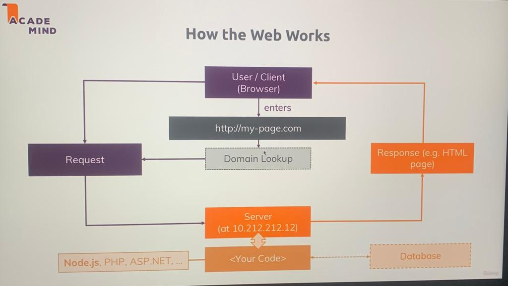

# 24 : Module Introduction

# what all we will be learning in this module 

1. How does the web works (refresher) ?
2. creating a Node js server.
3. Using node core modules.
4. working with request and responses (Basic).
5. Asynchronous code and the Event loop.

---
# 25 : How the web works ?
this below is the image from the course itself.


### what are the HTTP and HTTPS protocols

1. hyper text transfer protocol ==> it is understood by the browser and is the set of rules that construct the way a request must be made.
2. hyper text transfer protocol secure ==> it is same as the HTTP but with Data encryption (during data transmission)

---

# 26 : Creating a node server

1. created a nodejs server at first-nodejs-server folder
2. below , these are the core nodejs modules

   http ----> is used to launch a server and send requests.

   https ---> is used to launch a ssl encrypted server

   fs ------> is used to access the file system of the machine on which the server is running

   path ----> is used to set paths of files and many other things like images and icons.

   os ------> is used to have access to the operating system of the machine on which the server is up and running

3. 
```js
// require is a special reserved keyword in js which is used to access modules which are made for js applications

const http = require('http') // this will seatch for a module named http
const http = require('./http') // (absolute path) this will seatch for a https.js file in the same directory locally
const http = require('/http') // (relative path) this will seatch for a https.js file in the same directory locally
// three of the above examples auto complete the .js extension by there own 

```
4.  here below is the code which is so basic : 
```js
const http = require('http') 

// we stored the server into the server variable which is returned by the createServer method on the http module

const server = http.createServer((req,res)=>{
    console.log(req)
})

// this below line means the server will listen at the (localhost:3000) whenever a new request is gemerated on the port 3000.
server.listen(3000)
```

---

# 27 : the node lifecycle and the eventloop

node js program life cycle is as given below
1. we run the server using the " node app.js " command then
2. node starts the script which we have written in our app.js then
3. code get's parsed , variables and functions are registered by node then
4. with the help of event loop our program runs untill it has eventlistners registered

we have a brief example of lifecycle of nodejs on the below link to gfg
https://www.geeksforgeeks.org/nodejs-program-lifecycle/

Lifecycle of Node.js program: In order to understand its lifecycle you must be familiar with the event loop. Event loops are something that makes your task very fast and also it perform multitasking. It allows Node.js to perform non-blocking I/O operations. You can learn more about event loop here. When you run your node file using node app.js then the script starts executing. It will be parsed by the parser into machine language that simply means all the functions and variables get registered in a memory location. After parsing the code our program reaches the point where it will not exit and will run an infinite no. of times which is possible all because of the event loop. Once the event loop has started executing and it will run as long as event listeners are registered.

Example: You have the database and you have to access data from the database or you want to insert something into a database that simply requires some calling of the functions so when you call them it will take some amount of time (maybe nanoseconds or microseconds but it will take some time) so it is not possible for every request that we can wait for that particular time and then we move on to next request so that is where event loop comes into the picture. Your database part will be run in the background and the event loop will be running continuously so that it can handle the need for another request as well. This will be done on a single thread in node.js. You can also come out of the loop explicitly by using process.exit().

```diff
- note
+ nodejs is able to work and keep our server up and running due to the eventloop 
+ eventloop is the one and only thing which is responsible to keep our server running and also doing multitasking.
+ this is the line which registered an event listener into the eventloop and 
+ will keep that event listner of request in the eventloop untill we dont say it to 
+ remove it , and thats why it is able to keep the server running with looping the same line of code of listening.
        const server = http.createServer((req,res)=>{
            console.log(req)
        })

        ```
+ here if we use the process.exit() , what it does is that it hard exitted the eventloop which we typically do not do to our server as we want our server to be running .
```
5. code for app.js
```js
const http = require('http') 

// we stored the server into the server variable which is returned by the createServer method on the http module

const server = http.createServer((req,res)=>{
    console.log(req)
    //  here if we use the process.exit() , what it does is that it hard exitted the eventloop which we typically do not do to our server as we want our server to be running .
    // process.exit()
})

// this below line means the server will listen at the (localhost:3000) whenever a new request is gemerated on the port 3000.
server.listen(3000)
```

---

# 28 : Controlling the Node.js Process
 
Want to quit your running Node.js server?

You can always do that by pressing CTRL + C in the terminal/ command prompt window where you started your server (i.e. where you ran node app.js).

---

# 29 : understanding requests 

after running the below code we got the below result :
code :
```js
const server = http.createServer((req,res)=>{
    console.log("request.url -->  "+req.url )
    console.log("request.method -->  "+req.method )
    console.log(req.headers)
    //  here if we use the process.exit() , what it does is that it hard exitted the eventloop which we typically do not do to our server as we want our server to be running .
    process.exit()
})
```

and the result we got after running the " node app.js " command is as below:

```shell
request.url -->  /sss
request.method -->  GET
{
  host: 'localhost:8080',
  connection: 'keep-alive',
  'cache-control': 'max-age=0',
  'sec-ch-ua': '"Not_A Brand";v="99", "Google Chrome";v="109", "Chromium";v="109"',
  'sec-ch-ua-mobile': '?0',
  'sec-ch-ua-platform': '"macOS"',
  'upgrade-insecure-requests': '1',
  'user-agent': 'Mozilla/5.0 (Macintosh; Intel Mac OS X 10_15_7) AppleWebKit/537.36 (KHTML, like Gecko) Chrome/109.0.0.0 Safari/537.36',
  accept: 'text/html,application/xhtml+xml,application/xml;q=0.9,image/avif,image/webp,image/apng,*/*;q=0.8,application/signed-exchange;v=b3;q=0.9',
  'sec-fetch-site': 'none',
  'sec-fetch-mode': 'navigate',
  'sec-fetch-user': '?1',
  'sec-fetch-dest': 'document',
  'accept-encoding': 'gzip, deflate, br',
  'accept-language': 'en-US,en;q=0.9',
  cookie: 'adb=0; ufi=1; _gcl_au=1.1.71061844.1676256894; _ga=GA1.1.1650143955.1676256899; _gid=GA1.1.708053828.1676256899; inactivityTimer=1'
}
```

---

# 30 : Sending responses 


